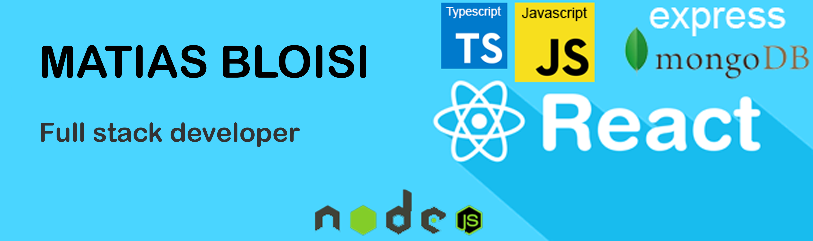

# Matias Bloisi

  

  Frontend Engineer from Argentina building web and mobile products with React, Next.js and React Native.

  <a href="mailto:matiibloisi@gmail.com">Email</a> |
  <a href="https://www.linkedin.com/in/matiasbloisi">LinkedIn</a> |
  <a href="https://github.com/MB-ARG">GitHub</a>

## Resume Summary

This CV summarizes a frontend profile with more than 4 years of experience building scalable web and mobile products.

I focus on:

- React, Next.js, React Native and Astro
- Component-based architecture and TypeScript
- Performance, SEO and Lighthouse optimization
- Integrations with Supabase, Firebase, GraphQL and REST APIs
- UI development with Tailwind, Styled Components and Sass

## Key Numbers

- `4+ years` of frontend experience
- `3` main career stages: Aware Invest, Quuack and Hausy
- `90+` performance on key projects
- `70%` performance improvement at GUT agency
- `Cross-platform` web + mobile with React Native and Next.js

## Featured Experience

### Hausy
`February 2025 - Present`

- Smart building management system.
- Cross-platform development with React Native and Next.js.
- Supabase integration and Home Assistant automation.
- Dashboard for energy monitoring and device control.

### Quuack
`June 2022 - February 2025`

- Web and mobile products focused on scalability.
- Reusable component architecture.
- Performance optimization and SEO improvements.

### Aware Invest
`June 2021 - 2022`

- Investment platform with interactive financial charts.
- API integration and scalable architecture.

## Key Projects

- **MPERATIV**: revenue marketing platform with React, Redux and Styled Components.
- **EPIC Aerospace**: landing page with Next.js, Sanity CMS and complete SEO.
- **Cammionity**: React Native app with theming and centralized state.
- **GUT agency**: legacy refactor and major performance improvement.

## Stack

**Frontend:** React, Next.js, React Native, Astro

**State:** Redux Toolkit

**Styling:** Tailwind, Styled Components, Sass

**Backend / APIs:** Supabase, Firebase, GraphQL, REST

**CMS:** Sanity, Contentful

**Testing:** Jest

**Dev Tools:** Git, GitHub Actions, ESLint, Prettier, Storybook

**Methodologies:** Scrum, Design Thinking

## Education

- Full Stack Web Developer - Henry Bootcamp
- Web Testing - Platzi
- Languages: Spanish native, English B1, German A1.2

## Stats

  

  

